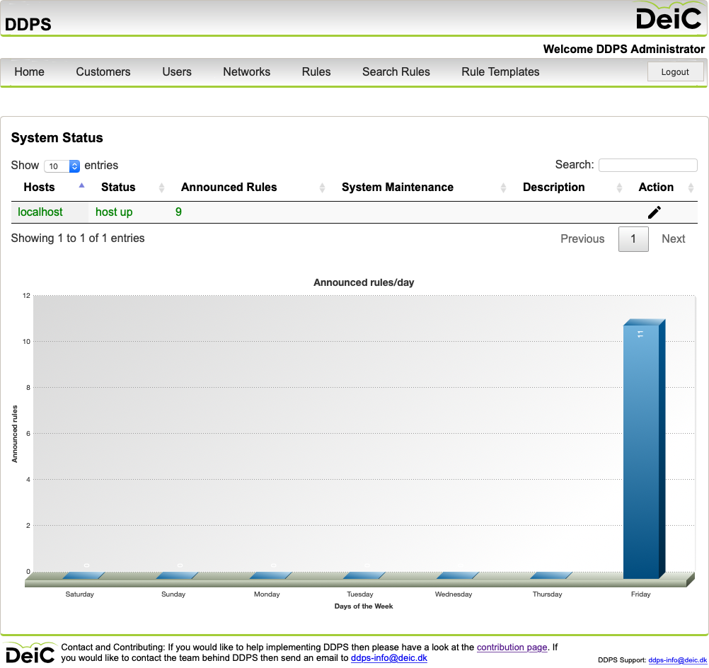
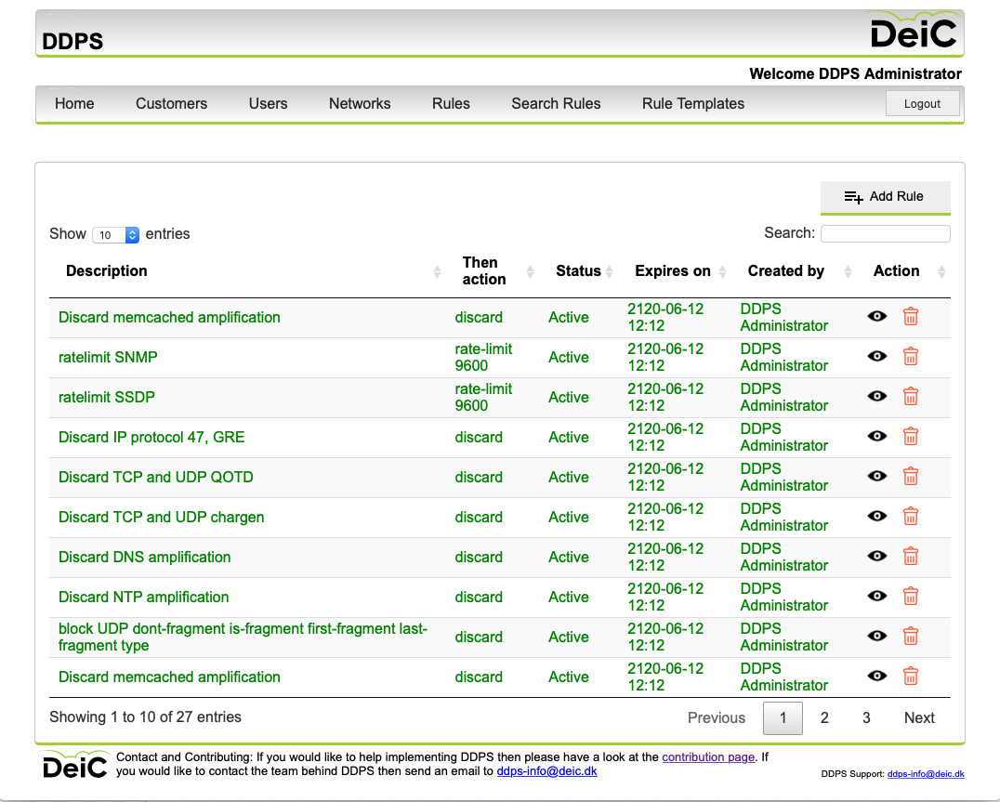
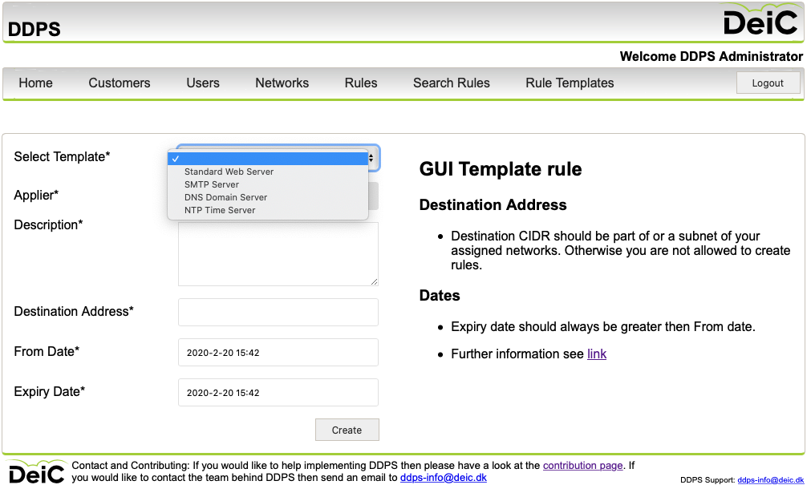
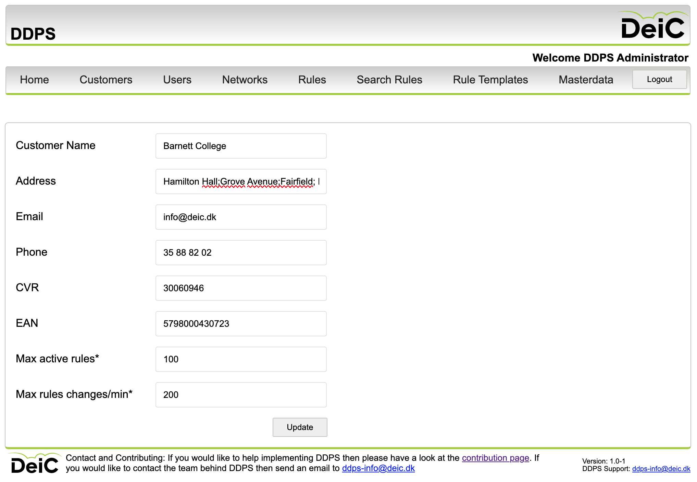

# DeiC Distributed Denial of Service Attack Prevention System, DDPS

DDPS is a customer self service system for mitigating DDOS attacks build for the Danish research network, DeIC. An administrator may create rules for the organisations own network(s) which then are announced using BGP flowspec. 

The current version of DDPS consists of

  - a GUI aimed towards customers which allows for creation, viewing and withdrawing of simple BGP flowspec rules
  - an API for creating and applying rules for automated mitigation. An example on how to use it with the community edition of fastnetmon can be found [here](src/example_client/using_the_api_with_fastnetmon.md). 
  - a simple command line utility for the _global administrator_ that allows the creation of more complex rules

The GUI is - hopefully - capable of being understood without explanation.

The system does not detect attacks, the focus is due diligent mitigation. Also notice that the rules are not permanent but have an optional begin and fixed end time.

## Bringing up the test environment

The test environment consist of two hosts:

  - `ww1`: server running DDPS 
  - `fw1`: an [GoBGP](https://github.com/osrg/gobgp) acting as uplink with the ability to just print the announced flowspec rules

Bringing up the test system requires [vagrant](https://www.vagrantup.com/intro/index.html) and [VirtualBox](https://www.virtualbox.org) and may be done by executing the commands

	vagrant destroy -f; vagrant box update ; vagrant up; vagrant vbguest; vagrant reload

This will install everything using [Ansible](https://www.ansible.com) (installed on `ww1`). The image uses [vagrant synced folders](https://www.vagrantup.com/docs/synced-folders) which in some scenarios doesn't work. If so, please see [docs/vagrant-synced-folders-not-working](docs/vagrant-synced-folders-not-working.md). 

You may have to install `vagrant plugin install vagrant-vbguest`, see [this info](https://coderwall.com/p/mvf0aq/vagrant-auto-update-virtualbox-guest-additions).

### Access

The GUI and API run as [server blocks](https://www.nginx.com/resources/wiki/start/topics/examples/server_blocks/) on the same host, so please add the following to your laptop's `/etc/hosts`:

```bash
192.168.33.12	api.ddps.deic.dk
192.168.33.12	www.ddps.deic.dk
```

  - [GUI access](http://www.ddps.deic.dk), login with `administrator` / `1qazxsw2`
  - API access, see the CLI example
  - For [ssh](https://en.wikipedia.org/wiki/Secure_Shell) access use `vagrant ssh ww1` and  `vagrant ssh fw1`

## Documentation

The system has a model with

  - **One global administrator** who can create customers, network-administrators and networks and rule(s) for all network(s)
  - **A set of customers** to whom a subset of _all network_ has been delegated
  - **Each customer has a local administrator** who can create and remove network administrators and create rule(s) for all the customers networks
  - **A set of customer network administrators** who may make rules for those of the customers network the administrator has been assigned

In the demonstration / test environment the password `1qazxsw2` is used everywhere except for the `vagrant` user. The environment consist of

  - **Administrators**: one global administrator `administrator` password `1qazxsw2`
  - **Service provider/ISP**: Customer DeiC
  - **Networks**: [RFC1918](https://tools.ietf.org/html/rfc1918)
  - **Customers**: The tree example customers has been defined as Barnett College, Metropolis University and Hudson University.

The example organisation _Barnett College_ has a local administrator `badm` password `1qazxsw2` and the network administrator `abnetadm` password `1qazxsw2`. The organisation has been assigned the network `10.0.0.0/8` and the network administrator has been granted rights for creating rules for the network. To add add additional local and network administrators for the other organisations, see [how to add local administrators, network administrators and create rules](docs/create_localadmin_and_network_admins.md).

Notice the limitation on administrators, as the _administrator login name_ must be unique across the customers. This may change in the future.

### Configuration for the test environment

The vagrant image brings up a test environment with the [default Vagrant settings](https://varyingvagrantvagrants.org/docs/en-US/default-credentials/) `root`/`vagrant` and `vagrant`/`vagrant` and one host based on Ubuntu 20.04 with one interface and port forwarding for `8080/http`, `8443/https` and `5432/postgres`. The system consists of one host with DDPS and [GoBGP](https://github.com/osrg/gobgp). In the test environment the same GoBGP instance is accessed as two separate servers; one running on `localhost` while the other is running on `ww1`.

### Credentials used in the test environment

All passwords for the system and access to the postgres database is defined as

| user name |  password  |
| --------- | --------   |
| admin     | `1qazxsw2` |
| dbadmin   | `1qazxsw2` |
| flowuser  | `1qazxsw2` |
| postgres  | `1qazxsw2` |
| repuser   | `1qazxsw2` |

### Database

The values for `max_active_rules` and `max_rule_fluctuation_time_window` have been set low in the database for all customers to ease testing. The first parameter states how many active rules a specific customer may have at a given time, while the other describes how many rules a customer is allowed to add within a certain time window.

These figures may be change only by the global administrator from Customers->Customer.

### GUI

The GUI is running on `http://localhost:8080` / `http://192.168.33.10`  in the test environment. Planned downtime is displayed on the home page (system status - use the pencil icon to edit planned system maintenance)



The GUI is intended for network administrators and has limitation on the complexity of the flowspec rules. A *local administrator* or *network administrator* may only apply rules for owned networks. Only the _global administrator_ may apply rules for all defined networks. It is possible to search for applied rules, show rule status etc.



It is possible to apply of-the-shelf-rules allowing for example TCP port 80 and 443 while blocking all other IP protocols and fragments types `is-fragment dont-fragment first-fragment last-fragment`.



### Rule status

Rule status may be one of

  -  **Pending**: The rule is new and yet not announced
  -  **Active**: The rule is active and announced to uplink
  -  **Expired**: The rule has expired and is withdrawn
  -  **Rule deleted**: The rule was deleted by an operator
  -  **Program error**: An unforeseen error occurred
  -  **Invalid flowspec**: The rule doesn't comply with [RFC5575](https://tools.ietf.org/html/rfc5575) but has somehow found its way into the database
  -  **Failed to implement rule**: The rule cannot be implemented due to software errors with hopefully further information `/var/log/syslog`

### Master data

Customer properties may be edited by the global admin from the customers menu. Each customer may have a specific limit on the total number of active rules and how many rules may be added or deleted each minute, as the enforcing router(s) have limitations. 



The users can see the values for Max and current active rules and current and Rule fluctuations/min for their own organisation only.

### CLI tools

Flowspec rules sent to `fw1` may be viewed on `fw1` with

	gobgp global rib -a ipv4-flowspec|sed '/Network.*Next.*/d; s/fictitious.*$//; s/^*> //'

The command line tools should only by accessible by authorised persons, as they _reveal database passwords_ and uses global systems privileges.  View system status

    /opt/db2bgp/bin/ddpsctl status

Change state with `systemd` tools.

`````bash
db2bgp.pl -l                       # show expired rules
db2bgp.pl -p                       # show active rules
gobgp global rib -a ipv4-flowspec  # show BGP flowspec announces
gobgp neighbor                     # show BGP neighbor status
`````

Remove _all announcements_ from GoBGP and prevent all rules from being re-announced

    /opt/db2bgp/bin/ddpsctl panic

Apply a set of _default filters_ preventing most [_DDoS Attack Vector Frequency_](https://www.akamai.com/de/de/multimedia/documents/state-of-the-internet/q2-2017-state-of-the-internet-security-report.pdf) (page 8) and a few extras

	/opt/db2bgp/bin/apply_default_rules.sh

The script uses `db2bgp.pl` to add the rules. For more help on the command line rule adding, see `db2bgp.pl -a help`

Removing active rules may be done with `db2bgp.pl -e rule-uuid`, where the `rule-uid` may be printed with `db2bgp.pl -p`. The command is for internal use only; customers should use the GUI or the API for rule creation.

`````bash
Rule UUID                              Valid until                      Status   Action               Description
------------------------------------------------------------------------------------------------------------------------
ad83ef21-364f-4454-904d-de84fa423aa9   2119-11-23 12:54:48.257045+01    Active   discard              Discard NTP amplification
8dd4de16-ca87-41a4-ae80-bd6fe27738c2   2119-11-23 12:54:47.2659+01      Active   discard              Discard NTP amplification
26c6866a-bd99-4d80-9fbe-5e7247602aa2   2119-11-23 12:54:49.613631+01    Active   discard              Discard TCP and UDP QOTD
...
167ee4e6-8efe-46ff-9fdf-32ca700ba339   2119-11-23 12:54:47.866257+01    Active   rate-limit 9600      ratelimit SSDP
read 16 rules
`````

The GUI is intended for customer access, the command line is intended for internal use by the ISP network operators on an ad-hoc basis. More information on rule creation is available here: [command line rules help](docs/cli-rules-help.md) and [GUI rules help](docs/gui-rules-help.md).

If the system (re-)starts in such a way, that the background process begins before the BGP service is ready, existing rules may fail to be implemented, and the _rule state_ will show _Failed to implement rule_. This situation may be fixed with the command `sudo /opt/db2bgp/bin/reactivate_not_expired_rules.sh`.

## Main difference between test and production environment

In the production environment the web-server is behind a VPN service and there are several GoBGP servers and a set of routers for enforcement. Nothing of this is needed to see how the system works. Juniper has an excellent guide on Flowspec configuration in [BGP_FLowspec](https://www.juniper.net/documentation/en_US/day-one-books/DO_BGP_FLowspec.pdf) from their Juniper day 1 series. Other vendors may have similar documentation.

Notice, **the system is not intended to be directly accessible from the Internet**.

### API

The API is described [here](docs/API.md) with a simple client example.

### SSH trust

SSH trust must be enabled for the user `ddpsusr` from where the database and web-service is running to the _gobgp sites_ including `localhost` if used.

## Roadmap

We intend to 

  - Extend the _API_ and build a command with the same functionality as the current CLI but without its limitations. 
  - Add more _Templates_ for protecting specific services
  - Work with _distance based mitigation_: by defining different BGP communities we would be able to only implement mitigation towards our [default upstream](http://nordu.net) or our [DIX](https://www.dix.dk). The idea is explained [here](https://networklessons.com/bgp/bgp-communities-explained).
  - Allow for IPv6 using [draft-ietf-idr-flow-spec-v6-10](https://tools.ietf.org/html/draft-ietf-idr-flow-spec-v6-10)

## Contact and Contributing

If you would like help implementing DDPS then please have a look at the [contributing](docs/contributing.md) page. If you would like to contact the team behind DDPS then send an email to [ddps-info@deic.dk](mailto:ddps-info@deic.dk)

The code is made primarily by Mehran Khan and Niels Thomas Haugård, with the contribution of other from DEiC and i2.

## License

DDPS is copyright 2021, DeiC, Denmark. See license file.

Licensed under the [Apache License, Version 2.0](http://www.apache.org/licenses/LICENSE-2.0)
(the "License"); you may not use this software except in compliance with the
License.

Unless required by applicable law or agreed to in writing, software distributed
under the License is distributed on an "AS IS" BASIS, WITHOUT WARRANTIES OR
CONDITIONS OF ANY KIND, either express or implied. See the License for the
specific language governing permissions and limitations under the License.

At least the following other licences apply:

  - [PostgreSQL](https://www.postgresql.org/about/licence/) - essentially a BSD license
  - [php7](https://www.php.net/license/index.php) has their own BSD style license
  - [smarty](https://www.smarty.net) - LGBPL
  - [golang](https://golang.org/LICENSE) - a BSD license. Each module may have a separate license
  - [perl](https://dev.perl.org/licenses/) which also covers the used perl modules. Each license
    may be found on [http://search.cpan.org](http://search.cpan.org).

