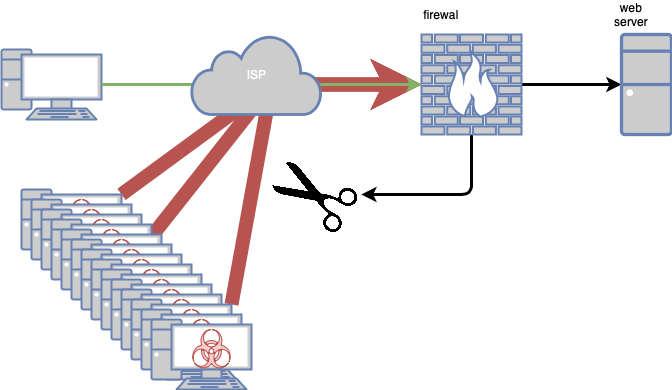
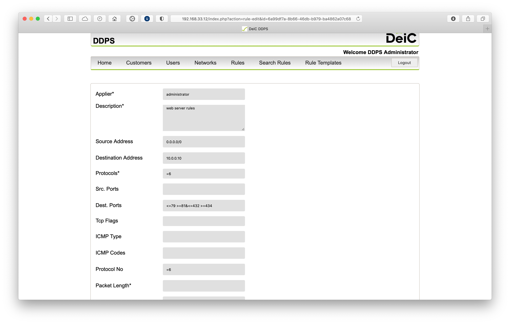
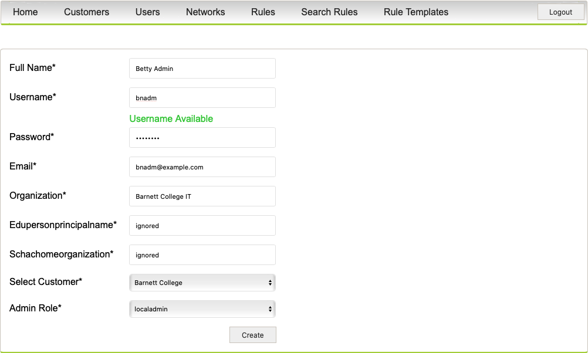
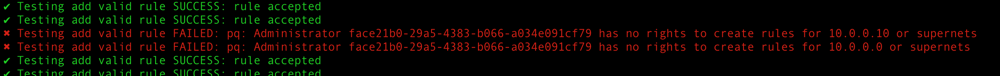

# How to use the API

The API implements match rules for discriminating traffic and has the following fields which are all mandatory even if not used:

  - `durationminutes`: The rule is implemented as soon as possible and will last for this number of minutes
  - `destinationport`: The UDP/TCP port on the destination host, see `/etc/services`
  - `sourceport`: The UDP/TCP port of the source address see `/etc/services`
  - `icmptype`: The ICMP types, see [iana.org](https://www.iana.org/assignments/icmp-parameters/icmp-parameters.xhtml)
  - `icmpcode`:The ICMP codes, see [iana.org](https://www.iana.org/assignments/icmp-parameters/icmp-parameters.xhtml)
  - `packetlength`: The length of the packages
  - `dscp`: Differentiated Services Field (DS Field) in the IPv4 and IPv6 Headers [rfc2474](https://datatracker.ietf.org/doc/html/rfc2474)
  - `description`: A description for why the rule is required
  - `destinationprefix`: The destination IP address in [CIDR](https://en.wikipedia.org/wiki/Classless_Inter-Domain_Routing) format
  - `sourceprefix`: The source IP address in [CIDR](https://en.wikipedia.org/wiki/Classless_Inter-Domain_Routing) format
  - `thenaction`: What to do on a match
  - `fragmentencoding`: TCP fragment encoding, see [Wikipedia](https://en.wikipedia.org/wiki/IPv4)
  - `ipprotocol`: IP protocol, see `/etc/protocols` 
  - `tcpflags`: TCP flags, see [Wikipedia](https://en.wikipedia.org/wiki/Transmission_Control_Protocol)

The fields `destinationport`, `sourceport`, `icmptype`, `icmpcode`, `packetlength`, `dscp` and `ipprotocol` must be specified as numeric values. Multiple values may be specified separated by space.
The `&` sign may be used to specify if two conditions should be fulfilled in order to match something.
The `>`and `<` may be used to specify a higher or lower value, while the combination `=>` and `=<` will include the value itself.

If the value of `ipprotocol` is `<=5&>=7`, then the field will match all other protocols than TCP (IP protocol 6), and if the value of `destinationport` is defined as as `<=79 >81&<=442 >444` it will match all other ports than 80 and 443.


| Name              | Range     | Description                                  | Maximum string length |
| ----------------- | --------- | -------------------------------------------- | --------------------- |
| durationminutes   | 10 - 1440 | Number of minutes the rule should be active  |                       |
| destinationport   | 0 - 2^16  | Portnumbers - 0 is a valid number here       | 128 chars             |
| sourceport        | same      |                                              | 128 chars             |
| icmptype          | 0 - 255   | These are fields that may exist in a package | 128 chars             |
| icmpcode          | 0 - 255   |                                              | 128 chars             |
| packetlength      | 64 - 9000 | See note                                     | 128 chars             |
| dscp              | 0 - 63    |                                              | 128 chars             |
| description       | UTF8      |                                              | 256 chars             |
| destinationprefix | CIDR      | One CIDR                                     | inet                  |
| sourceprefix      | CIDR      | One CIDR                                     | inet                  |
| thenaction        | See note  | A specific predefined action                 |                       |
| fragmentencoding  | Fragments | List of fragments                            | See note              |
| ipprotocol        | 0 - 255   | Protocol numbers                             | 128 chars             |
| tcpflags          | Flags     | Valid TCP flags, see note                    | 128 chars             |

Notes:
  - `packetlength`: Minimum header size is 20, 1 required for data, maximum is 65535. In practice all small packages are padded to 64 bit and large packages split in segments.
  - `thenaction`:  One of `accept`, `discard`, `rate-limit 9600`, `rate-limit 19200` or `rate-limit 38400`
  - `fragmentencoding`: One or more of `is-fragment`, `dont-fragment`, `first-fragment`, `last-fragment` and `not-a-fragment`
  - `tcpflags`: One or more of `fin`, `syn`, `rst`, `push`, `ack` and `urgent`

When a value is out of range, or the syntax is incorrect, the rule is discarded. And [fail2ban](https://www.fail2ban.org/wiki/index.php/Main_Page) may decide to deny access for a while.

## Example usage

Let's assume an organisation have a webserver behind a firewall, and for the sake of simplicity there isn't any other hosts or network traffic which has to be accounted for. The firewall prevents all non http and https traffic to reach the web server, while allowing outgoing traffic like TCP reply and DNS. All fragments are prohibited as well as packages with TCP options. Now assume this system comes under a volumetric DDoS attack; temporary in nature, volatile and only intended to disrupt or prevent legitimate use. While the firewall blocks the traffic, the attack consumes all bandwidth so an effective mitigation will require the firewall to extend the enforcement upstream to the ISP. 



The firewall must detect the attack - which is out of the scope of this text - and be able to react while there are still bandwidth left. This is where the API comes to use. The firewall must have a client application matching the API and be able to instrument the mitigation; here is an example written in [shell](https://en.wikipedia.org/wiki/Unix_shell). If the firewall cannot detect the nature of the attack, a simple mitigation would be to mimic the policy upstream; block all traffic which is not the TCP protocol and destination port 80 or 443.

The API is simple; connect and sign in to receive a JWT token,  calculate mitigation and send it. The following assumes running in Vagrant, so the connection part would would require only what is needed for the authentication

```bash
host="192.168.33.12"
USERNAME="some-existing-user"
PASSWORD="some-existing-users-password"
ROUTER_SIGNIN="http://${host}:8888/signin"
```

Receiving the [json web tokens](https://en.wikipedia.org/wiki/JSON_Web_Token) may be done with [curl](https://en.wikipedia.org/wiki/CURL):

```bash
TOKEN=$( curl -k -c - -s -X POST                                  \
    -H 'Accept: application/json'                                 \
    -H 'Content-Type: application/json'                           \
    --data "{                                                     \
        \"username\":\"${USERNAME}\",\"password\":\"${PASSWORD}\" \
        }" "${ROUTER_SIGNIN}" |
    sed '/token/!d; s/.*token//g; s/[[:space:]]*//g'
    )
```

The token will expire after 10 minutes. Rules are converted to [BGP flowspec](https://tools.ietf.org/html/rfc5575). Fields may have a set of values describing a *match* resulting in _thenaction_ to be executed. Fields may be left empty, meaning they matches everything. Rules should be atomic; the implementation order is not predictable and may be manufacture dependent. Notice, that in production a valid [wireguard](https://en.wikipedia.org/wiki/WireGuard) configuration is required. The rules are implemented in [this part of the code](../src/db2bgp/ddps_endpoints.sql).

To protect the web server we will ask the ISP to only allow TCP port 80 and 443 with no fragments to the address 10.0.0.10/32. To prevent disruption, we will allow all [TCP flags](https://en.wikipedia.org/wiki/Transmission_Control_Protocol) (`fin`, `syn`, `rst`, `push`, `ack` and `urgent`).

  - The `ipprotocol` field may be used to specify a match on _all protocols except TCP_ - which has protocol number 6 as `<=5&>=7`
  - The same goes for the destination port, where the expression `<=79 >=81&<=432 >=434` may be used to describe _all other ports_ than 80 and 443.
  - Fragments may be described with `is-fragment dont-fragment first-fragment last-fragment` meaning only `not-a-fragment` is not matched.
  - The source and destination IP address field must only contain one non-empty [CIDR](https://en.wikipedia.org/wiki/Classless_Inter-Domain_Routing) each. The destination address must be one, the sign-in user is allowed to create rules for. The source address must be outside of the organisations scope.
  - The list of valid `thenaction` 's  may be found in the GUI (`accept`, `discard`, `rate-limit 9600`, `rate-limit 19200` and `rate-limit 38400`).

Here is the final rule:

```json
{
  "durationminutes" : "10",
  "destinationport": "<=79 >=81&<=432 >=434",
  "sourceport": "",
  "icmptype": "",
  "icmpcode": "",
  "packetlength": "",
  "dscp": "",
  "description": "web server rules",
  "destinationprefix": "10.0.0.10/32",
  "sourceprefix": "0.0.0.0/0",
  "thenaction": "discard",
  "fragmentencoding": "dont-fragment is-fragment first-fragment last-fragment",
  "ipprotocol": "=6",
  "tcpflags": ""
}
```

If the rule is saved to the file `rules.json`, the command for blocking would be

```bash
ADD_STATUS=$( curl -k -s -c /dev/null    \
    -H 'Accept: application/json'        \
    -H 'Content-Type: application/json'  \
    -H "Cookie: token=${TOKEN}"          \
    -d @rules.json -X post "${ROUTER_ADDRULE}"
)
```

The status `rule accepted` indicate that the rule was valid, the login user has the required rights to apply the rule and the syntax was correct. When viewed in the GUI, the rule looks like this:

 

There is more information in the document [GUI rule creation](). Be aware that rules are _temporary in nature_ and does therefore not replace a perimeter firewall.

## Example use of the API

Say _Barnett College_ would like to have yet an other netblok and make rules using the API for it. First, assign an unused netblok then setup a (new) user for the API and finally test it is working.

- From **Networks** select the pencil next to _netblock192_, and change the customer to Barnet College then click update.
- Next go to **Users** and create a new user named `bapi` with password `1qazxsw2` and a (fake) email for the person in charge of the API setup. Select customer _Varnet College_, and set _admin role_ to `netadmin`. Assign the network `192.168.0.0/16`to the new user and click Create.
  
- Edit the example API script [ `test-client-api.sh`](../src/ddps_api/test-client-api.sh) and change the `USERNAME`and `PASSWORD`. 
- Run the script as `bash test-client-api.sh` - the result should be success, except for two (test) which are for the `10.0.0.0/8` network, for which the administrator `bapi`is not allowed to create rules.




