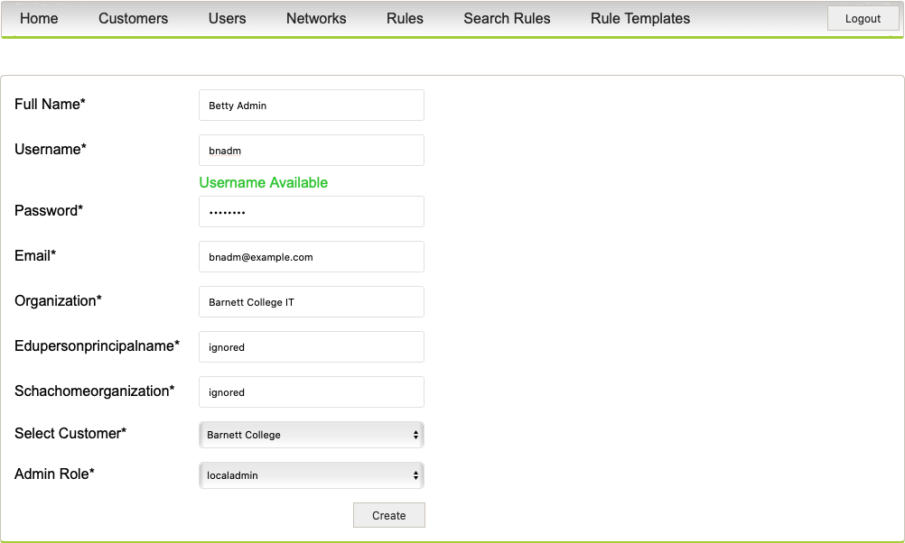

# Staff at Barnett College

In the example system, there is only one global administrator and tree customers with no staff nor assigned networks.
The following describes what has to be done, so _Barnett College_ can be self managed.

In the following, we will assign 10.0.0.0/8 to Barnett College and create a local admin named `baladm` and a network admin named `banadm`.

Log in as `administrator` and select `Networks` and click on the pencil icon next to `netblock10`. Change `DeiC` to `Barnett College` in Select Customer and click `update`.

Next click `Users` and press `Add User`, and create the user `Barnett Admin`, `baladm`, assign email (not used), Barnett College IT as Organisation, and `not used` for Edupersonprincipalname and Schachomeorganization (not used). Select Barnett College as Customer and assign the Admin Role `localadmin`. Assign a password and click update. This user will be able to create new network administrators. Log out and login as `bnadm` and notice you will now only see the user `bnadm`.

Create the network administrator `bnadm` the same way - _remember to assign the 10.0.0.0/8 network to the user_ and log out.



# Creating rules for Barnett College

Login as `banadm`, click `Rules` and select `Add rules`. Fill the description, leave source address and type `10.0.0.0/23` as destination address. Assume we want to block [GRE](https://en.wikipedia.org/wiki/Generic_Routing_Encapsulation). (Reason for example [here](https://badpackets.net/high-volume-of-protocol-47-gre-traffic-from-hinet-as3462-found/)). Press `Create` which on success full creation will take the user to the Rules page. The rule may have the state _Pending_, as the database is queried every 2 seconds. If so then press the `Rule` again to see the rule is applied and has status Active.


Customers are not intended to have command line access to the system. Log in use `vagrant ssh` and execute `gobgp global rib -a ipv4-flowspec|grep ==gre`:

```bash
*> [destination: 192.168.0.0/16][protocol: ==gre] fictitious  01:34:29 [{Origin: ?} {Extcomms: [discard]}]
```

To verify the announcement has reached the _uplink_, execute from `ww1`:

```
ssh fw1 'gobgp global rib -a ipv4-flowspec|grep ==gre'
```

