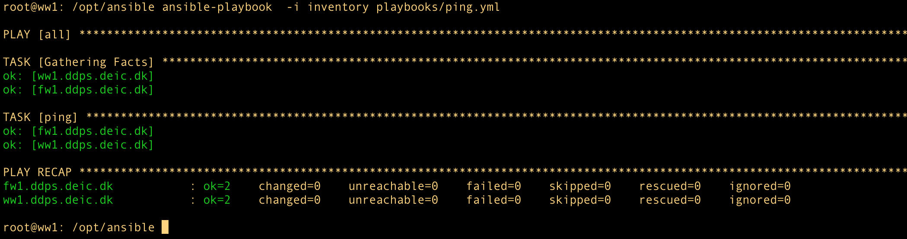

# When Vagrant synced folders doesn't work

And you are still interested in bringing up the image. You can do so by

  - rename `../vagrant/Vagrantfile` to `../vagrant/Vagrantfile.old`
  - rename `../vagrant/Vagrantfile.no.synced_folders` to `../vagrant/Vagrantfile`
  - install ansible on your laptop (see below)
  - run the commands below

```bash
for D in ansible vagrant
do
	test -d "$D"||{
		echo directory $D not found
		exit 127
	}
done

for tool in vagrant ansible VBoxManage 
do
	type $tool >/dev/null 2>&1 ||{
		echo tool $tool missing
		echo Please install Vagrant, Ansible and VirtualBox
		exit 127
	}
done

# check in /etc/hosts:
for X in api.ddps.deic.dk www.ddps.deic.dk 192.168.33.12 
do
	grep -q $X /etc/hosts|| {
		cat <<-EOF
Please add the following to your /etc/hosts

# for DDPS
192.168.33.12	api.ddps.deic.dk
192.168.33.12	www.ddps.deic.dk
EOF
}
done

if [ ! -f ~/.ssh/id_ed25519 ]; then
	cat << EOF
An id_ed25519 ssh key is required, make one with 
ssh-keygen -a 200 -t ED25519 -f ~/.ssh/id_ed25519
EOF
exit 127
fi

cd ../vagrant
vagrant destroy -f; vagrant box update ; vagrant up; vagrant reload

cd ../ansible
ansible-playbook  -i inventory playbooks/provision.yml

cd ../vagrant
vagrant reload
```

## Install Ansibe

You may install on OSX/Linux/OpenBSD as

```bash
export VENVDIR=/opt/ansible_venv
# prevent varnings 'parent directory is not owned ... current user'
export HOME=/root

if [ ! -f ${VENVDIR}/bin/activate ]; then
    python3 -m venv ${VENVDIR} --system-site-packages
    . ${VENVDIR}/bin/activate
    pip3 install --upgrade pip
    cat <<-EOF > ${VENVDIR}/requirements.txt
wheel   # latest
ansible # latest version
EOF
```

Where Linux may require `sudo apt-get -y install python3-venv` first.

# If you don't want Ansible on your laptop

First create and distribute ssh keys from the host `ww1` to `fw1`:

On `ww1` do

	sudo su - ansible
	ssh-keygen -a 200 -t ED25519 -f ~/.ssh/id_ed25519 -N ''

Then copy the public key to the host `fw1` for the same user. Check connectivity.

Next copy everything in the directory `ansible` to `ww1` and move it to `/opt/ansible`.

Then setup a python virtual environment - still as `root` on `ww1`:

```bash
apt update	# required or the next command fails
apt install --yes	python3 python3-pip python3-venv python3-dev	\
					build-essential python3-wheel python3-apt

# setup venv here
export VENVDIR=/opt/ansible_venv
# prevent varnings 'parent directory is not owned ... current user'
export HOME=/root

if [ ! -f ${VENVDIR}/bin/activate ]; then

	python3 -m venv ${VENVDIR} --system-site-packages
	. ${VENVDIR}/bin/activate
	pip3 install --upgrade pip
	cat <<-EOF > ${VENVDIR}/requirements.txt
wheel	# latest
ansible	# latest version
EOF

	# Install required modules
	pip3 install -r ${VENVDIR}/requirements.txt
	# ansible galaxy commands here
	:
	# ansible-galaxy collection install community.general
	:

fi

# The following is not so elegant but patching /etc/profile or /etc/bash.bashrc has
# no effect nor has adding '*.sh' files to /etc/profile.d;  they are being ignored.
# This works somehow, but doesn't scale
for f in $( find /root/ /home/ -name .bashrc )
do
	if (grep -q 'bin/activate' ${f}  ); then
		:
	else
		cat <<-EOF >> ${f}
if [ -f ${VENVDIR}/bin/activate ]; then
. ${VENVDIR}/bin/activate
fi
EOF
	fi
done
```

Finally test everything is working with the command as the user `ansible`:

```bash
echo '. /opt/ansible_venv/bin/activate
cd /ansible
ansible-playbook  -i inventory playbooks/ping.yml'
```
If the result is similar to the image below, then run the next command



```bash
ansible-playbook  -i inventory playbooks/provision.yml'
```


